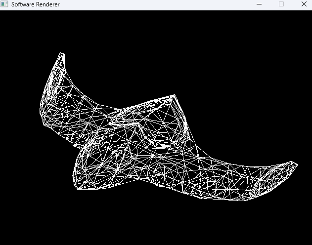

# SR-1-Carga-de-modelos

Este proyecto, denominado "SR-1-Carga-de-modelos", se centra en la carga y visualización de modelos 3D en formato `.obj`. Utilizando la biblioteca SDL para la creación de la ventana y el renderizado, junto con la biblioteca GLM para las transformaciones matemáticas, este proyecto demuestra cómo se pueden leer y mostrar modelos 3D en un entorno de software.

## Imagen

## Visualización de Modelos OBJ
El formato de archivo OBJ es un formato estándar para representar modelos 3D. Es ampliamente utilizado debido a su simplicidad y capacidad para almacenar detalles como coordenadas de vértices, caras y texturas. En este proyecto, se procesa un archivo OBJ para extraer esta información y luego se utiliza para renderizar un modelo 3D en la pantalla, mostrando así cómo se puede trabajar con gráficos 3D a un nivel básico.

## Estructura del Proyecto

- `main.cpp`: Contiene la función principal del programa y la lógica para cargar y renderizar el modelo 3D.
- `CMakeLists.txt`: Configuración de CMake para compilar el proyecto.
- `utils.h`: Define estructuras y funciones auxiliares.
- `sdlFunctions.h`: Funciones para manejar operaciones específicas de SDL, como la inicialización y el renderizado.
- `objLoader.h`: Funciones para cargar modelos desde archivos OBJ.
- `spaceship.obj`: Ejemplo de un modelo 3D en formato OBJ.
- `spaceship.png`: Imagen renderizada del modelo.

## Uso

1. Clone este repositorio en su máquina local.
2. Asegúrese de tener SDL2 y GLM instalados en su sistema.
3. Navegue hasta el directorio del proyecto y cree un directorio de compilación: `mkdir build && cd build`.
4. Ejecute CMake para configurar el proyecto: `cmake ..`.
5. Compile el proyecto: `cmake --build .`.
6. Ejecute el programa resultante: `./SR_1_Carga_de_modelos`.

## Autor
- [Javier Ramírez]
